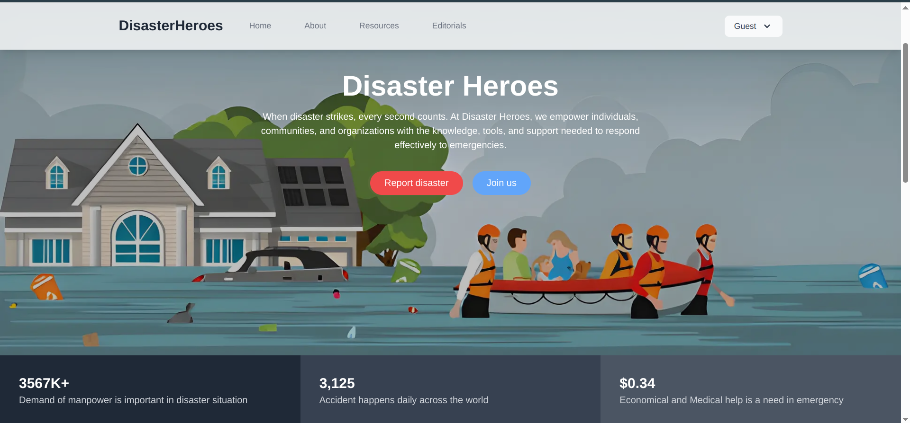
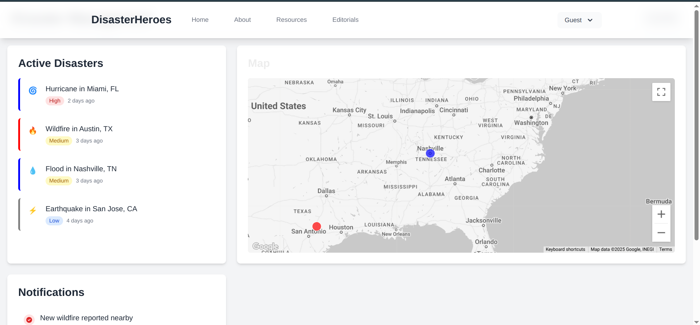

# Disaster Heroes

Disaster Heroes is a comprehensive disaster management platform designed to empower individuals, communities, and organizations with the knowledge, tools, and support needed to respond effectively to emergencies.



## 🚨 Features

- **Real-time Disaster Reporting** - Report disasters with detailed information including location, images, and descriptions
- **Interactive Map Interface** - Visualize disaster events with Google Maps integration
- **User Authentication** - Secure registration and login system
- **Member Dashboard** - Track active disasters and notifications
- **Resource Coordination** - Access tools for effective resource management during crises
- **Mobile-responsive Design** - Fully responsive interface for all devices

## 🛠️ Tech Stack

- **Frontend Framework**: [Next.js 15](https://nextjs.org/) with App Router
- **UI Library**: [React 19](https://react.dev/)
- **Styling**: [Tailwind CSS](https://tailwindcss.com/)
- **Maps Integration**: [Google Maps API](https://developers.google.com/maps) 
- **Form Components**: [@headlessui/react](https://headlessui.com/)
- **HTTP Client**: [Axios](https://axios-http.com/)
- **Icons**: [Lucide React](https://lucide.dev/) and [React Icons](https://react-icons.github.io/react-icons/)
- **Type Safety**: [TypeScript](https://www.typescriptlang.org/)

## 🚀 Getting Started

### Prerequisites

- Node.js 18.x or higher
- npm, yarn, or pnpm
- Google Maps API key

### Installation

1. Clone the repository
   ```bash
   git clone https://github.com/yourusername/disaster-heroes.git
   cd disaster-heroes
   ```

2. Install dependencies
   ```bash
   npm install
   # or
   yarn install
   # or
   pnpm install
   ```

3. Set up environment variables
   ```bash
   cp .env.example .env.local
   ```
   
   Edit `.env.local` and add your Google Maps API key and other required variables:
   ```
   NEXT_PUBLIC_GOOGLE_MAPS_API_KEY=your_google_maps_api_key
   NEXT_PUBLIC_GOOGLE_MAP_ID=your_google_map_id
   NEXT_PUBLIC_API_URL=your_api_url
   ```

4. Run the development server
   ```bash
   npm run dev
   # or
   yarn dev
   # or
   pnpm dev
   ```

5. Open [http://localhost:3000](http://localhost:3000) with your browser to see the application

## 📱 Application Pages

- **Home (`/`)**: Landing page with disaster statistics and key information
- **Login (`/login`)**: User authentication
- **Register (`/register`)**: New user registration
- **Report (`/report`)**: Disaster reporting interface with location mapping
- **Member Dashboard (`/member`)**: Active disasters tracking and notifications

## 🛡️ Environment Variables

| Variable | Description | Required |
|----------|-------------|----------|
| `NEXT_PUBLIC_GOOGLE_MAPS_API_KEY` | Google Maps API key | Yes |
| `NEXT_PUBLIC_GOOGLE_MAP_ID` | Google Maps Map ID | Yes |
| `NEXT_PUBLIC_API_URL` | Backend API URL | Yes |

## 🧪 Testing

```bash
npm run lint
# or
yarn lint
# or
pnpm lint
```

## 📦 Build for Production

```bash
npm run build
npm run start
# or
yarn build
yarn start
# or
pnpm build
pnpm start
```

## 🌐 Deployment

The application can be easily deployed to Vercel:

[](https://vercel.com/new/git/external?repository-url=https://github.com/yourusername/disaster-heroes)

## 📝 License

[MIT](LICENSE)

## 👥 Contributing

Contributions are welcome! Please feel free to submit a Pull Request.

1. Fork the repository
2. Create your feature branch (`git checkout -b feature/amazing-feature`)
3. Commit your changes (`git commit -m 'Add some amazing feature'`)
4. Push to the branch (`git push origin feature/amazing-feature`)
5. Open a Pull Request
